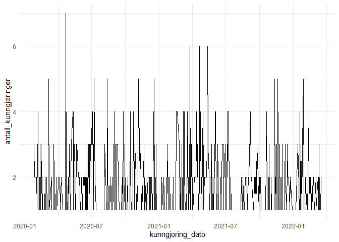
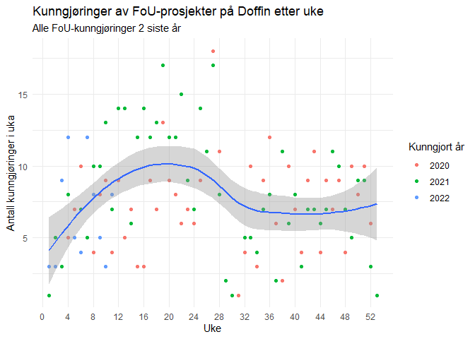
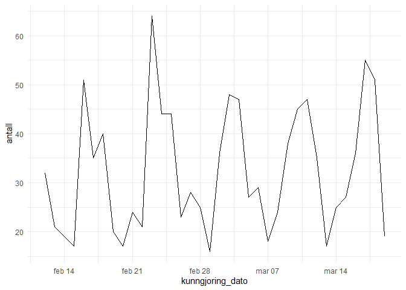
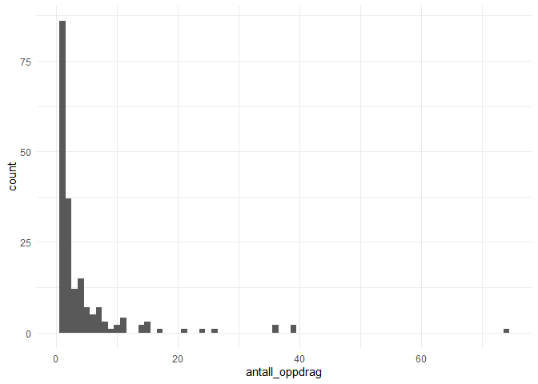

POC - Doffin-analyse
================

-   [Henter data ved hjelp av skraper-funksjonene og litt
    looping](#henter-data-ved-hjelp-av-skraper-funksjonene-og-litt-looping)
-   [Grunnleggende om datasettet](#grunnleggende-om-datasettet)
-   [Når lyses prosjektene ut?](#når-lyses-prosjektene-ut)
-   [Lengde på frister](#lengde-på-frister)
-   [Antall oppdrag etter oppdragsgiver (de største
    )](#antall-oppdrag-etter-oppdragsgiver-de-største-)

``` r
#biblioteker
library(tidyverse)
```

    ## -- Attaching packages --------------------------------------- tidyverse 1.3.1 --

    ## v ggplot2 3.3.5     v purrr   0.3.4
    ## v tibble  3.1.6     v dplyr   1.0.7
    ## v tidyr   1.1.4     v stringr 1.4.0
    ## v readr   2.1.1     v forcats 0.5.1

    ## -- Conflicts ------------------------------------------ tidyverse_conflicts() --
    ## x dplyr::filter() masks stats::filter()
    ## x dplyr::lag()    masks stats::lag()

``` r
library(knitr)
library(rvest)
```

    ## 
    ## Attaching package: 'rvest'

    ## The following object is masked from 'package:readr':
    ## 
    ##     guess_encoding

``` r
library(janitor)
```

    ## 
    ## Attaching package: 'janitor'

    ## The following objects are masked from 'package:stats':
    ## 
    ##     chisq.test, fisher.test

``` r
library(lubridate)
```

    ## 
    ## Attaching package: 'lubridate'

    ## The following objects are masked from 'package:base':
    ## 
    ##     date, intersect, setdiff, union

``` r
#støttefunksjoner
source("scripts/scraper_functions.R")  

#valg
options(scipen = 100)
tema = theme_set(theme_minimal())

#Hvis et kurrant datasett eksisterer, bruk det  istedet for å laste inn alt mulig.
df <- read_delim("data/doffin_foucpv_17032020-17032022.csv", delim = ";", escape_double = FALSE, trim_ws = TRUE)
```

    ## Rows: 852 Columns: 13

    ## -- Column specification --------------------------------------------------------
    ## Delimiter: ";"
    ## chr  (7): doffin_referanse, navn, publisert_av, kunngjoring_type, lenke, cpv...
    ## dbl  (4): estimert_totalverdi, kunngjort_uke, kunngjort_år, fristlengde
    ## date (2): kunngjoring_dato, tilbudsfrist_dato

    ## 
    ## i Use `spec()` to retrieve the full column specification for this data.
    ## i Specify the column types or set `show_col_types = FALSE` to quiet this message.

# Henter data ved hjelp av skraper-funksjonene og litt looping

``` r
#DEL 1 - CPV 73000000

#Henter først ut data for CPV 73000000 
#for de siste to år (30 dager av gangen)
#kun kunngjøringer av konkurranser
#inkluderer også utgåtte konkurranser

cpv_oppslag = "73000000"

resultater = data.frame()

#beregner hvor mange 30 dagers perioder jeg trenger mellom i dag og en anna dato
lengde = ceiling(as.numeric(difftime(as.Date(Sys.Date()), as.Date("17.03.2020", "%d.%m.%Y"), units = "days")) / 30)

for(i in 0:lengde){
  #lager dato
  tildato = format((Sys.Date() - (30*i)), "%d.%m.%Y")
  fradato = format((Sys.Date() - (30*(i+1))), "%d.%m.%Y")
  
  #lager URL for spørring
  url = doffin_url_builder(
    NoticeType = "2",
    Cpvs = cpv_oppslag,
    PublishedFromDate = fradato, 
    PublishedToDate = tildato,
    IncludeExpired = "true"
  )
  temp_resultater = doffin_fetch_results_long(url)
  resultater = bind_rows(resultater, temp_resultater)
}
```

``` r
#fjerner litt overflødig tekst

resultater = mutate(resultater,
              doffin_referanse = str_remove(doffin_referanse, fixed("Doffin referanse: ")),
              publisert_av = str_remove(publisert_av, fixed("\r Publisert av:\r ")),
              publisert_av = str_remove_all(publisert_av, fixed("\r")),
              kunngjoring_type = str_remove(kunngjoring_type, fixed("Kunngjøringstype: ")),
              kunngjoring_dato = str_remove(kunngjoring_dato, fixed("Kunngjøringsdato: "))
              )
```

``` r
##slår opp ytterligere informasjon om de jeg har

#NB! før neste kjøring, fiks NA i xpath for sum/verdi
##denne xpathen ser ut til å feile og finne teksten "Denne anskaffelsen er delt opp i delkontrakter:"  i noen tilfeller?
#eksempler som ikke funker
#/Notice/Details/2022-303150 - har ikke info om beløp
#/Notice/Details/2022-359995 - har ikke info om beløp
#/Notice/Details/2020-359116 - har ikke info om beløp
#bør jeg da også legge inn en sjekk av at det jeg finner, faktisk er et beløp?
#evt bare den uparsa tekststrengen? 


#NB! Kan ta veldig lang tid å kjøre, avhengig av antallet treff fra over!
for(i in 1:nrow(resultater)){
  mer_info <- read_html(paste0("https://doffin.no", resultater[i,7]))
  
  temp_cpv = html_element(mer_info, xpath = "//*[@id='notice']/div[3]/div[2]/div[5]/div/span") %>%
    html_text2()
  if(length(temp_cpv) > 0){
    resultater$cpv[i] = temp_cpv
  }
  if(length(temp_cpv) == 0){
    resultater$cpv[i] = NA
  }
  
  temp_beskrivelse = html_element(mer_info, xpath = "//*[@id='notice']/div[3]/div[2]/div[9]/div") %>%
    html_text2()
  if(length(temp_beskrivelse) > 0){
    resultater$beskrivelse[i] = temp_beskrivelse
  }
  if(length(temp_beskrivelse) == 0){
    resultater$beskrivelse[i] = NA
  }
  
  #denne xpathen ser ut til å feile og finne teksten "Denne anskaffelsen er delt opp i delkontrakter:"  i noen tilfeller?
  temp_sum = html_element(mer_info, xpath = "//*[@id='notice']/div[3]/div[2]/div[11]") %>%
    html_text2() %>%
    #punktum som punktum lager problemer, må fjernes (tror disse bare kommer som inkl og ekskl)
    str_remove(., fixed("ekskl.")) %>% 
    str_remove(., fixed("inkl.")) %>%
    parse_number()
  
  
  if(length(temp_sum) > 0){
    resultater$estimert_totalverdi[i] = temp_sum
  }
  if(length(temp_sum) == 0){
    resultater$estimert_totalverdi[i] = NA
  }
  
  Sys.sleep(2)
}
```

``` r
#er det duplikater her, på doffin-nummeret?
test = get_dupes(df, doffin_referanse)
test = get_dupes(df, doffin_referanse, kunngjoring_dato, beskrivelse, fristlengde)
test = get_dupes(df)

#det kan det fort være
#usikker på hva det skyldes - kan det være rettelser?
#de har helt like datoer, beskrivelser,
#eller kan det være datooverlapp fra spørringen?
```

``` r
#litt databearbeidelse

#i fravær av en grunn, slettes dupliakter
df = distinct(df, .keep_all = TRUE)

df = mutate(resultater,
            kunngjoring_dato = as.Date(kunngjoring_dato),
            tilbudsfrist_dato = as.Date(tilbudsfrist_dato),
            kunngjort_uke = week(kunngjoring_dato),
            kunngjort_år = year(kunngjoring_dato),
            fristlengde = as.numeric(difftime(tilbudsfrist_dato, kunngjoring_dato, units = "days")),
            #får en del usannsynlige frister som sannsynligvis er feil her
            fristlengde = ifelse(fristlengde > 200, NA, fristlengde)
              )
```

``` r
#lagrer datasettet
write_excel_csv2(df, "data/funn_stort_datasett.csv")
```

# Grunnleggende om datasettet

Her har vi 852 kunngjorte konkurranser med CPV-koden 73000000 -
Forskning og utvikling, fra 17. mars 2020 til 17. mars 2022.

# Når lyses prosjektene ut?

``` r
#dato
temp = group_by(df, kunngjoring_dato) %>%
  summarise(antall_kunngjøringer = n())

ggplot(data = temp) +
  geom_line(aes(x = kunngjoring_dato, y = antall_kunngjøringer))
```

<!-- -->

``` r
#uke
temp = group_by(df, kunngjort_år, kunngjort_uke) %>%
  summarise(antall_kunngjøringer = n())
```

    ## `summarise()` has grouped output by 'kunngjort_år'. You can override using the `.groups` argument.

``` r
ggplot(data = temp) +
  geom_point(aes(x = kunngjort_uke, y = antall_kunngjøringer, colour = as.factor(kunngjort_år))) +
  geom_smooth(aes(x = kunngjort_uke, y = antall_kunngjøringer)) +
  scale_x_continuous(breaks = seq(from = 0, to = 52, by = 4), minor_breaks = NULL) +
  labs(x = "Uke", y = "Antall kunngjøringer i uka", colour = "Kunngjort år", title = "Kunngjøringer av FoU-prosjekter på Doffin etter uke", 
       subtitle = "Alle FoU-kunngjøringer 2 siste år")
```

    ## `geom_smooth()` using method = 'loess' and formula 'y ~ x'

<!-- -->

# Lengde på frister

``` r
summary(df$fristlengde)
```

    ##    Min. 1st Qu.  Median    Mean 3rd Qu.    Max.    NA's 
    ##    8.00   23.00   31.00   32.92   37.00  113.00      21

``` r
ggplot(data = df, aes(x = fristlengde)) +
  geom_histogram(binwidth = 1) +
  labs(title = "Tid fra kunngjøring til frist for leveranse", subtitle = "Alle cpv 73000000-utlysninger på doffin fra 17. mars 2020 til 17. mars 2022",
       x = "Antall dager", y = "Antall utlysninger"
       )
```

    ## Warning: Removed 21 rows containing non-finite values (stat_bin).

<!-- -->

# Antall oppdrag etter oppdragsgiver (de største )

``` r
temp = group_by(df, publisert_av) %>%
  summarise(
    antall_oppdrag = n()
  )

summary(temp$antall_oppdrag)
```

    ##    Min. 1st Qu.  Median    Mean 3rd Qu.    Max. 
    ##   1.000   1.000   2.000   4.415   4.000  74.000

``` r
ggplot(data = temp, aes(x = antall_oppdrag)) +
  geom_histogram(binwidth = 1)
```

<!-- -->

``` r
tabell = slice_max(temp, antall_oppdrag, n = 20)
knitr::kable(tabell)
```

| publisert_av                                         | antall_oppdrag |
|:-----------------------------------------------------|---------------:|
| Kommunal- og moderniseringsdepartementet             |             74 |
| Barne-, ungdoms- og familiedirektoratet              |             39 |
| Integrerings- og mangfoldsdirektoratet (IMDi)        |             39 |
| Norges forskningsråd                                 |             36 |
| Utdanningsdirektoratet                               |             36 |
| Norges vassdrags- og energidirektorat (NVE)          |             26 |
| Norad – Direktoratet for utviklingssamarbeid         |             24 |
| Statens vegvesen                                     |             21 |
| Arbeids- og sosialdepartementet                      |             17 |
| Kunnskapsdepartementet                               |             15 |
| Miljødirektoratet                                    |             15 |
| Samferdselsdepartementet                             |             15 |
| Direktoratet for forvaltning og økonomistyring (DFØ) |             14 |
| Nærings- og fiskeridepartementet                     |             14 |
| Husbanken                                            |             11 |
| Møre og Romsdal Fylkeskommune                        |             11 |
| Universitetet i Oslo                                 |             11 |
| Utlendingsdirektoratet - UDI                         |             11 |
| Justis- og beredskapsdepartementet                   |             10 |
| SYKEHUSINNKJØP HF                                    |             10 |

``` r
#og etter år
temp = group_by(df, kunngjort_år, publisert_av) %>%
  summarise(
    antall_oppdrag = n()
  ) %>%
  pivot_wider(names_from = kunngjort_år, values_from = antall_oppdrag)
```

    ## `summarise()` has grouped output by 'kunngjort_år'. You can override using the `.groups` argument.

``` r
tabell = slice_max(temp, `2022`, n = 10)
knitr::kable(tabell)
```

| publisert_av                                         | 2020 | 2021 | 2022 |
|:-----------------------------------------------------|-----:|-----:|-----:|
| Kommunal- og distriktsdepartementet                  |   NA |   NA |    8 |
| Integrerings- og mangfoldsdirektoratet (IMDi)        |    8 |   24 |    7 |
| Norges forskningsråd                                 |   17 |   15 |    4 |
| Arbeids- og inkluderingsdepartementet                |   NA |    1 |    3 |
| Barne-, ungdoms- og familiedirektoratet              |   17 |   20 |    2 |
| Direktoratet for forvaltning og økonomistyring (DFØ) |    3 |    9 |    2 |
| Nærings- og fiskeridepartementet                     |    3 |    9 |    2 |
| Samferdselsdepartementet                             |    5 |    8 |    2 |
| Statens vegvesen                                     |    9 |   10 |    2 |
| Utdanningsdirektoratet                               |   14 |   20 |    2 |
| Nordland fylkeskommune                               |   NA |    3 |    2 |
| Kultur- og likestillingsdepartementet                |   NA |   NA |    2 |
